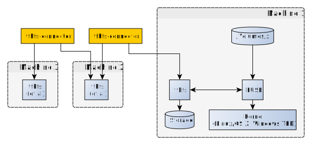

go-tfhfs
========

*NOTE*: This project is now officially stalled, as in practical
 benchmarking it is simply not fast enough. The modern SSDs
 (gigabytes/second, crazy IOPS) and fuse (few hundred megabytes/second,
 slower IOPS) are simply not match made in heaven it seems.

This is the next-generation rewrite (Dec 2017 - Mar 2018) of my earlier
[tfhfs project](https://github.com/fingon/tfhfs) that was written in
Python. This can be considered pre-alpha; it mostly works, but I do not
recommend using it yet except to test if you are curious.

Design changes:

* using inodes instead of paths as bases for the btree forest => semantics
more closely match UNIX

* implement it in Go, instead of Python (mostly because FUSE performance at
  least on OS X seems rather horrid within Python compared to Go; see my
  [fuse bindings benchmark](https://github.com/fingon/fuse-binding-test)
  for more details

* make the design leverage parallelism much more ( parallel sha256,
  encryption, tree merging )



[Performance figures](perf.md)

Build
-----

```
# go get github.com/fingon/go-tfhfs/...
```

(or get it via git for the amusing sanitytest.sh)

Usage
-----

With go get, the tools of interest are `tfhfs` and `tfhfs-connector`
binaries (more documentation TBD, look at sanitytest.sh or usage if you
feel adventurous).

With git checkout, after running `make`, the main point of entry is
`./sanitytest.sh` which runs minimal test which consists of:

* mounting one volume at /tmp/x (with server at localhost:12345)

* mounting second volume at /tmp/y (with server at localhost:12346)

* copying thigs from root filesystem (/bin/ls mainly) and setting things up
in /tmp/x

* synchronizing the state between /tmp/x and /tmp/y using tfhfs-connector
utility

* umounting /tmp/x, /tmp/y

* remounting /tmp/x using the same fixed storage

* still ensuring /tmp/x has state we set up there

*NOTE*: You REALLY do not want to expose tfhfs server to non-localhost use
at the moment; it is plain HTTP/1.1 without any security
mechanisms. However, as the block content itself is not plaintext, and it
performs relatively rigorous checks on input, even exposing it to public
Internet will have only not particularly bad outcomes:

* resource exhaustion attack (store lot of blocks)

* network utilization attack (get blocks ad nauseaum)

* (limited) synchronization mischief; can attempt to merge in bit older
roots, but typically merge routine should simply ignore this.


Used tests to verify sanity
---------------------------

- My FUSE oriented variant of fstest: https://github.com/fingon/fstest (fuse
branch)

- fstorture from Apple fstools: https://github.com/macosforge/fstools

Known limitations
-----------------

See [TODO](TODO.md)
